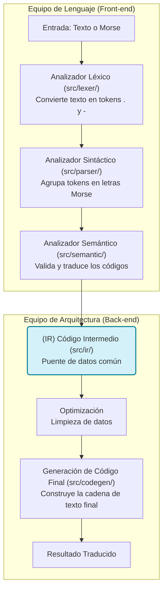
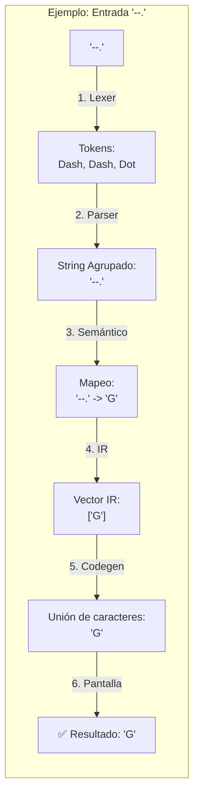

# 📡 Traductor Morse Bidireccional - Guía Maestro

Un traductor de **código Morse** profesional construido en **Rust**, que utiliza una arquitectura de **pipeline de compilación** completo (Análisis Léxico, Sintáctico, Semántico, Representación Intermedia y Generación de Código).

---

## 🏗️ 1. Arquitectura del Sistema (Flujo M x N)

Este proyecto no es una simple búsqueda de texto; es un compilador real. Sigue el diseño clásico de un motor de lenguajes, permitiendo múltiples entradas y una representación común.

| Etapa          | Módulo          | Propósito y Lexemas                                                           |
| -------------- | --------------- | ----------------------------------------------------------------------------- |
| **Léxico**     | `src/lexer/`    | Rompe el texto en**tokens** (`Dot`, `Dash`, `Space`).                         |
| **Sintáctico** | `src/parser/`   | Agrupa tokens en secuencias con sentido (letras morse). Usa el lexema `push`. |
| **Semántico**  | `src/semantic/` | Valida códigos y traduce usando**HashMaps** y el método `.insert()`.          |
| **IR**         | `src/ir/`       | **Representación Intermedia**: El puente común para todos los lenguajes.      |
| **Generación** | `src/codegen/`  | Crea la cadena final usando `.collect()` e `.iter()`.                         |

### 📊 Diagrama de Flujo (Modelo M x N)

El flujo sigue la estructura de un compilador "desacoplado", igual que el esquema clásico de diseño de lenguajes:



### 🔍 Trazabilidad de una Traducción (Paso a Paso)
¿Qué ocurre exactamente cuando traduces Morse a Texto? Aquí tienes el viaje de un símbolo:




### 🛠️ Desección Técnica: Entendiendo el Código (Línea por Línea)

A continuación, desglosamos cada parte de tu código para entender qué significa cada palabra clave (**lexema**) y símbolo.

---

#### 📂 1. Módulo Codegen (`src/codegen/translator.rs`)
Este módulo se encarga de la **Generación de Código Final**.

```rust
pub fn generate(ir: IR) -> String {
    ir.letters.iter().collect()
}
```
*   **`pub`**: Palabra clave para "Público". Permite que esta función sea vista y usada desde `main.rs`.
*   **`fn`**: Abreviatura de "Function". Indica el inicio de una función.
*   **`generate`**: El nombre que le dimos a la función.
*   **`(ir: IR)`**: El parámetro de entrada. Recibe un objeto de tipo `IR` (Representación Intermedia) y lo llama `ir` dentro de la función.
*   **`-> String`**: La **flecha de retorno**. Indica que esta función promete entregar un texto (`String`) al terminar.
*   **`ir.letters`**: Accede a la lista de letras guardadas en el objeto `ir`.
*   **`.iter()`**: Crea un **iterador** (un desfile de elementos uno por uno).
*   **`.collect()`**: Es el lexema que "recolecta" las piezas del desfile y las pega para formar el `String` final.

---

#### 📂 2. Módulo Semántico (`src/semantic/analyzer.rs`)
Aquí es donde se define el "significado" de los códigos Morse.

```rust
fn get_morse_map() -> HashMap<String, char> {
    let mut map = HashMap::new();
    map.insert("...".to_string(), 'S');
}
```
*   **`HashMap<String, char>`**: Un diccionario donde la clave es un texto (`String`) y el valor es un caracter (`char`).
*   **`let mut map`**: `let` crea la variable. `mut` (mutable) es el lexema que permite que añadamos datos a la libreta vacía.
*   **`HashMap::new()`**: Crea la libreta de direcciones vacía.
*   **`.insert()`**: Es la acción de escribir una nueva entrada en la libreta (Código -> Letra).
*   **`"...".to_string()`**: Convierte un texto fijo en un objeto `String` dinámico que Rust puede manipular.

---

#### 📂 3. Módulo Lexer (`src/lexer/token.rs`)
Define los componentes básicos (**tokens**).

```rust
#[derive(Logos, Debug, PartialEq)]
pub enum Token {
    #[token(".")]
    Dot,
}
```
*   **`#[derive(...)]`**: Es un lexema de "metaprogramación". Le pide a Rust que genere código automáticamente por nosotros para poder imprimir (`Debug`) o comparar (`PartialEq`) los tokens.
*   **`enum`**: Define una lista de opciones fijas. Un token solo puede ser `Dot`, `Dash`, `Space` o `Text`.
*   **`#[token(".")]`**: Es un decorador que vincula el símbolo visual `.` con la variante lógica `Dot`.

---

#### 📂 4. Módulo Parser (`src/parser/core.rs`)
Agrupa los tokens en unidades con sentido.

```rust
pub fn parse(tokens: Vec<Token>) -> Vec<String> {
    let mut result = Vec::new();
    for token in tokens { ... }
}
```
*   **`Vec<Token>`**: Una lista dinámica (Vector) que contiene objetos de tipo `Token`.
*   **`for token in tokens`**: El bucle que recorre cada pieza del "desfile".
*   **`match token`**: Es un lexema de "comparación de patrones". Es como un `switch` pero súper potente que obliga a cubrir todas las opciones.

---

#### 📂 5. Orquestador y Menú (`src/main.rs` e `interactive.rs`)
Donde todo se une y se comunica con el usuario.

```rust
use std::io::{self, Write};

pub fn run_interactive_mode() {
    let mut choice = String::new();
    io::stdin().read_line(&mut choice).expect("Error");
}
```
*   **`use std::io`**: El lexema `use` importa una caja de herramientas (librería estándar) para Entrada/Salida (`io`).
*   **`{self, Write}`**: Importa `io` mismo y la capacidad de escribir en pantalla (`Write`).
*   **`io::stdin()`**: Llama a la función de "Entrada Estándar" del sistema.
*   **`.read_line(&mut choice)`**: Este método detiene el programa y espera a que el usuario escriba algo.
*   **`&mut choice`**: El símbolo `&` indica una **referencia** (le prestamos la variable a la función). `mut` indica que la función tiene permiso para cambiar el contenido de esa variable con lo que el usuario escriba.
*   **`.expect()`**: Es el lexema que maneja errores críticos. Si algo falla al leer, el programa se detiene con ese mensaje.

---

#### 📂 6. Estructuras de Datos (`src/ir/representation.rs`)
Cómo organizamos la información en memoria.

```rust
#[derive(Debug)]
pub struct IR {
    pub letters: Vec<char>,
}
```
*   **`struct`**: Palabra clave para crear una "Estructura" personalizada. Es como una ficha técnica que agrupa diferentes datos relacionados.
*   **`letters: Vec<char>`**: Define un campo llamado `letters` que es un Vector de caracteres.
*   **`pub` (dentro de struct)**: No basta con que el `struct` sea público; sus campos también deben serlo si queremos acceder a ellos desde fuera.

---

#### 📂 7. Organización de Módulos (`mod.rs`)
La jerarquía del árbol.

```rust
pub mod core;
pub use core::parse;
```
*   **`mod core`**: Declara que existe un archivo llamado `core.rs` en esta misma carpeta.
*   **`pub use core::parse`**: Es un "re-exporte". Permite que alguien que use este módulo pueda llamar a `parse()` directamente sin tener que escribir `modulo::core::parse()`. Es un atajo de limpieza.

---

## 🚀 2. Guía de Inicio Rápido

### Instalación

```bash
git clone https://github.com/Shoshan-anjo/Proyecto_Diseno_Compiladores.git
cd Traductor_Lexer
cargo build --release
```

### Ejecución Rápida

```bash
# Morse a Texto (Interactivo)
cargo run

# Texto a Morse (CLI)
cargo run -- --to-morse "HOLA"
```

---

## 📋 3. Manual de Uso Detallado

### OPCIÓN 1: Modo Interactivo (Menú Visual)

Ejecuta el programa sin argumentos para ver el panel de control:

```bash
cargo run
```

**Operaciones disponibles:**

1. **Morse → Texto**: Ingresa códigos separados por espacios (ej. `... --- ...`).
2. **Texto → Morse**: Ingresa palabras o frases (ej. `mama`).
3. **Salir**: Cierra el traductor de forma segura.

### OPCIÓN 2: Modo Línea de Comandos (CLI)

Ideal para scripts o usuarios avanzados:

```bash
# Traducir Morse a Texto directo
./target/release/traductor.exe "...." "." ".-.." ".-.." "---"

# Traducir Texto a Morse con banderas
./target/release/traductor.exe --to-morse "HOLA MUNDO"

# Modo Detallado (Verbose) para ver el Pipeline
./target/release/traductor.exe --verbose --to-morse "HI"
```

### 🔧 Banderas Disponibles

- `-t, --to-morse`: Traduce de Texto a Morse (por defecto es Morse a Texto).
- `-v, --verbose`: Muestra cada paso de la arquitectura (Tokens, Parser, IR).
- `-h, --help`: Muestra la ayuda del sistema.

---

## 🧪 4. Desarrollo y Pruebas

El sistema cuenta con una cobertura completa de pruebas unitarias para cada módulo del pipeline.

**Ejecutar todas las pruebas:**

```bash
cargo test
```

### Estructura del Código

- `src/main.rs`: Orquestador principal y lógica de los `if` de entrada.
- `src/cli.rs`: Configuración de argumentos con la librería `clap`.
- `src/interactive.rs`: Implementación del menú interactivo (`stdin`/`stdout`).
- `src/ast/`: Definición de nodos del árbol sintáctico.

---

## 📖 5. Alfabeto Morse Soportado

### Letras y Números

- **A-Z**: Soporte completo de las 26 letras.
- **0-9**: Todos los dígitos numéricos.
- **Especiales**: `. , ? ' ! / ( ) & : ; = + - _ " $ @`

---

## 🔮 Próximos Pasos

- [ ] Soporte para entrada/salida de archivos.
- [ ] Reproducción de audio del código Morse.
- [ ] Compilación a WebAssembly (WASM).

---

**Hecho con ❤️ en Rust | v0.2.1**
_(Toda la arquitectura del traductor explicada en un solo lugar)._
