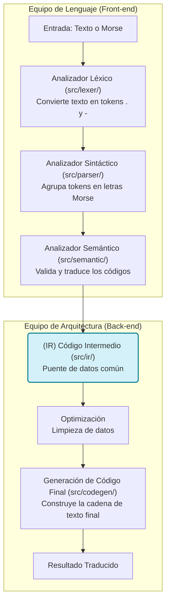
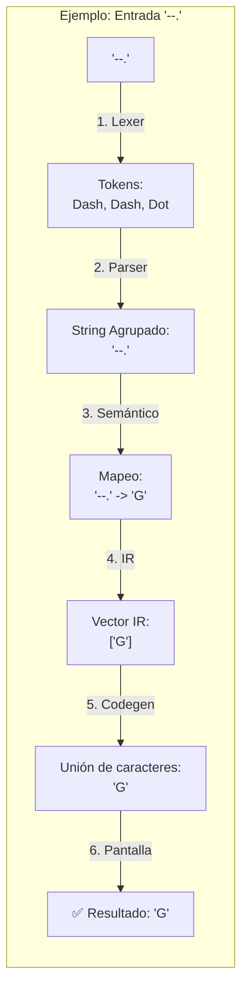

# 📡 Traductor Morse Bidireccional - Guía Maestro

Un traductor de **código Morse** profesional construido en **Rust**, que utiliza una arquitectura de **pipeline de compilación** completo (Análisis Léxico, Sintáctico, Semántico, Representación Intermedia y Generación de Código).

---

## 🏗️ 1. Arquitectura del Sistema (Flujo M x N)

Este proyecto no es una simple búsqueda de texto; es un compilador real. Sigue el diseño clásico de un motor de lenguajes, permitiendo múltiples entradas y una representación común.

| Etapa          | Módulo          | Propósito y Lexemas                                                           |
| -------------- | --------------- | ----------------------------------------------------------------------------- |
| **Léxico**     | `src/lexer/`    | Rompe el texto en**tokens** (`Dot`, `Dash`, `Space`).                         |
| **Sintáctico** | `src/parser/`   | Agrupa tokens en secuencias con sentido (letras morse). Usa el lexema `push`. |
| **Semántico**  | `src/semantic/` | Valida códigos y traduce usando**HashMaps** y el método `.insert()`.          |
| **IR**         | `src/ir/`       | **Representación Intermedia**: El puente común para todos los lenguajes.      |
| **Generación** | `src/codegen/`  | Crea la cadena final usando `.collect()` e `.iter()`.                         |

### 📊 Diagrama de Flujo (Modelo M x N)

El flujo sigue la estructura de un compilador "desacoplado", igual que el esquema clásico de diseño de lenguajes:



### 🔍 Trazabilidad de una Traducción (Paso a Paso)

¿Qué ocurre exactamente cuando traduces Morse a Texto? Aquí tienes el viaje de un símbolo:



---

## 🔬 Ejemplo Real: ¿Qué pasa cuando envías `"hola"`?

Esta sección traza **con valores concretos** cómo la palabra `hola` viaja a través de cada módulo del pipeline, dependiendo del modo de traducción elegido.

---

### 🔤 Camino A — Texto → Morse (`--to-morse "hola"`)

> **Módulo activo:** `src/semantic/encoder.rs` · función `text_to_morse()`
>
> En este camino el **Lexer, Parser, IR y Codegen no se invocan.** Toda la transformación ocurre en el módulo semántico.

**`main.rs`** detecta el flag `--to-morse` y llama directamente a:

```rust
// main.rs  línea 41
let morse_output = semantic::text_to_morse(&input);
```

Dentro de `text_to_morse()` en **`src/semantic/encoder.rs`**:

| Paso | Operación | Valor |
|------|-----------|-------|
| 1 | [`to_uppercase()`] Convierte a mayúsculas | `"HOLA"` |
| 2 | [`.split(' ')`] Divide por espacios (una sola palabra) | `["HOLA"]` |
| 3 | [`.chars()`] Recorre cada letra y busca en `get_char_to_morse_map()` | — |

```
H  →  map.get('H')  =  "...."
O  →  map.get('O')  =  "---"
L  →  map.get('L')  =  ".-.."
A  →  map.get('A')  =  ".-"
```

| 4 | [`.join(" ")`] Une los códigos de la palabra con espacio | `".... --- .-.. .-"` |
| 5 | [`.join(" / ")`] Une las palabras con separador (solo 1 palabra aquí) | — |

**Salida final:**
```
✅ Morse: .... --- .-.. .-
```

---

### 🔁 Camino B — Morse → Texto (`".... --- .-.. .-"`)

> Este es el **flujo completo** que pasa por **todos los 5 módulos** del pipeline.

```
".... --- .-.. .-"
         │
         ▼ Módulo 1: Lexer
         ▼ Módulo 2: Parser
         ▼ Módulo 3: Semántico
         ▼ Módulo 4: IR
         ▼ Módulo 5: Codegen
         │
      "HOLA"
```

---

#### 🔷 Módulo 1 — Análisis Léxico · `src/lexer/token.rs` · `Token::lexer()`

```rust
// main.rs  línea 56
let tokens: Vec<Token> = Token::lexer(input)
    .filter_map(|result| result.ok())
    .collect();
```

La librería `logos` escanea el string carácter a carácter y emite un `Token` por cada símbolo reconocido. Los caracteres inválidos son silenciosamente descartados por `.filter_map(|r| r.ok())`.

**Reglas activas de `Token`:**
```rust
#[token(".")]  →  Token::Dot
#[token("-")]  →  Token::Dash
#[token(" ")]  →  Token::Space
```

**Transformación de `".... --- .-.. .-"`:**

| Carácter | Token emitido |
|----------|--------------|
| `.` `.` `.` `.` | `Dot, Dot, Dot, Dot` |
| ` ` | `Space` |
| `-` `-` `-` | `Dash, Dash, Dash` |
| ` ` | `Space` |
| `.` `-` `.` `.` | `Dot, Dash, Dot, Dot` |
| ` ` | `Space` |
| `.` `-` | `Dot, Dash` |

**Salida del Lexer:**
```rust
[Dot, Dot, Dot, Dot, Space, Dash, Dash, Dash, Space, Dot, Dash, Dot, Dot, Space, Dot, Dash]
```

---

#### 🔷 Módulo 2 — Análisis Sintáctico · `src/parser/core.rs` · `parse()`

```rust
// main.rs  línea 65
let parsed = parser::parse(tokens);
```

El parser recorre el vector de tokens y usa un **buffer acumulador** (`current: String`). Cada `Dot`/`Dash` se añade al buffer. Cuando llega un `Space`, guarda el buffer en el resultado y lo limpia.

```rust
pub fn parse(tokens: Vec<Token>) -> Vec<String> {
    let mut current = String::new();
    for token in tokens {
        match token {
            Token::Dot  => current.push('.'),   // acumula punto
            Token::Dash => current.push('-'),   // acumula raya
            Token::Space => {
                if !current.is_empty() {
                    result.push(current.clone()); // guarda la letra
                    current.clear();              // resetea el buffer
                }
            }
        }
    }
}
```

**Transformación token por token:**

| Tokens consumidos | Buffer `current` | `result` al guardar |
|-------------------|-----------------|---------------------|
| `Dot Dot Dot Dot` | `"...."` | — |
| `Space` | `""` *(reset)* | `["...."]` |
| `Dash Dash Dash` | `"---"` | — |
| `Space` | `""` *(reset)* | `["....", "---"]` |
| `Dot Dash Dot Dot` | `".-.."` | — |
| `Space` | `""` *(reset)* | `["....", "---", ".-.."]` |
| `Dot Dash` | `".-"` | — |
| *(fin de lista)* | guarda último | `["....", "---", ".-..", ".-"]` |

**Salida del Parser:**
```rust
["....", "---", ".-..", ".-"]
```

---

#### 🔷 Módulo 3 — Análisis Semántico · `src/semantic/analyzer.rs` · `validate_and_translate()`

```rust
// main.rs  línea 72
let letters = semantic::validate_and_translate(parsed);
```

Cada string Morse se busca en el `HashMap` generado por `get_morse_map()`. Si el código **existe** devuelve el carácter; si **no existe** emite una advertencia y retorna `'?'`.

```rust
pub fn validate_and_translate(code: Vec<String>) -> Vec<char> {
    let morse_map = get_morse_map();
    code.iter()
        .filter_map(|morse| {
            morse_map.get(morse).copied().or_else(|| {
                eprintln!("⚠️  Morse code '{}' not recognized, using '?'", morse);
                Some('?')
            })
        })
        .collect()
}
```

**Traducción del diccionario (`HashMap<String, char>`):**

| Código Morse | Entrada al mapa | Resultado |
|-------------|-----------------|-----------|
| `"...."`    | `map.get("....")` | `'H'` ✅ |
| `"---"`     | `map.get("---")`  | `'O'` ✅ |
| `".-.."`    | `map.get(".-..")` | `'L'` ✅ |
| `".-"`      | `map.get(".-")`   | `'A'` ✅ |

**Salida del Analizador Semántico:**
```rust
['H', 'O', 'L', 'A']
```

---

#### 🔷 Módulo 4 — Representación Intermedia · `src/ir/representation.rs` · `struct IR`

```rust
// main.rs  línea 79
let ir = ir::IR { letters };
```

Este módulo no ejecuta lógica; es una **estructura de datos neutra** que desacopla el front-end (lexer/parser/semántico) del back-end (codegen). Es equivalente al "bytecode" de un compilador real.

```rust
pub struct IR {
    pub letters: Vec<char>,   // Las letras ya traducidas
}
```

**Estado del IR en este punto:**
```rust
IR { letters: ['H', 'O', 'L', 'A'] }
```

---

#### 🔷 Módulo 5 — Generación de Código · `src/codegen/translator.rs` · `generate()`

```rust
// main.rs  línea 86
let output = codegen::generate(ir);
```

El último paso toma el IR y convierte el `Vec<char>` en un `String` final usando el iterador:

```rust
pub fn generate(ir: IR) -> String {
    ir.letters.iter().collect()
    // ['H','O','L','A'] → "HOLA"
}
```

- **`.iter()`** — Crea un iterador sobre cada `char` del vector.
- **`.collect()`** — "Pega" todos los caracteres y los ensambla en un `String`.

**Salida final del pipeline:**
```
✅ Texto: HOLA
```

---

### 📊 Resumen visual del pipeline completo

```
"hola"  (--to-morse)
   │
   └──▶  semantic/encoder.rs · text_to_morse()
              "HOLA" → .... --- .-.. .-
                              │
          ┌───────────────────┘ (dirección inversa)
          ▼
".... --- .-.. .-"
   │
   ├──▶  [Módulo 1] lexer/token.rs · Token::lexer()
   │         [Dot,Dot,Dot,Dot, Space, Dash,Dash,Dash, Space, ...]
   │
   ├──▶  [Módulo 2] parser/core.rs · parse()
   │         ["....", "---", ".-..", ".-"]
   │
   ├──▶  [Módulo 3] semantic/analyzer.rs · validate_and_translate()
   │         ['H', 'O', 'L', 'A']
   │
   ├──▶  [Módulo 4] ir/representation.rs · struct IR
   │         IR { letters: ['H', 'O', 'L', 'A'] }
   │
   └──▶  [Módulo 5] codegen/translator.rs · generate()
             "HOLA"
```

---

## 🛠️ Desección Técnica: El Viaje del Código (Paso a Paso)

A continuación, explicamos cada módulo en el orden real en que el programa procesa tu entrada, detallando cada **lexema** y símbolo.

---

#### 📂 1. El Inicio: Orquestador y Menú (`src/main.rs`, `src/cli.rs`, `src/interactive.rs`)

Todo comienza aquí. El programa recibe tus datos y decide por qué tubería enviarlos.

```rust
use std::io::{self, Write};

pub fn run_interactive_mode() {
    let args = Args::parse();
    let mut choice = String::new();
    io::stdin().read_line(&mut choice).expect("Error");
}
```

- **`Args::parse()`**: Lee lo que escribiste en la terminal y lo convierte en datos que Rust entiende.
- **`use std::io`**: El lexema `use` importa herramientas de Entrada/Salida.
- **`io::stdin()`**: Activa la "oreja" del programa para escuchar tu teclado.
- **`.read_line(&mut choice)`**: Detiene el programa hasta que escribas algo y lo guarda en `choice`.
- **`&mut choice`**: El símbolo `&` indica una **referencia** y `mut` permite que el programa **cambie** el valor de esa variable con tu entrada.
- **`.expect()`**: Maneja errores críticos; si el sistema falla al leer, muestra ese mensaje.

---

#### 📂 2. Análisis Léxico (`src/lexer/token.rs`)

La entrada se rompe en trozos indivisibles llamados **tokens**.

```rust
#[derive(Logos, Debug, PartialEq)]
pub enum Token {
    #[token(".")]
    Dot,
}
```

- **`enum`**: Define una lista de opciones exclusivas (Solo puede ser `Dot`, `Dash`, etc.).
- **`#[token(".")]`**: Vincula físicamente el símbolo `.` con la entidad lógica `Dot`.
- **`#[derive(...)]`**: Es metaprogramación para que Rust sepa automáticamente comparar e imprimir estos tokens.

---

#### 📂 3. Análisis Sintáctico (`src/parser/core.rs`)

Aquí los tokens se agrupan en unidades con sentido lingüístico.

```rust
pub fn parse(tokens: Vec<Token>) -> Vec<String> {
    let mut result = Vec::new();
    for token in tokens { ... }
}
```

- **`Vec<Token>`**: Una lista dinámica (Vector) que recibe los tokens del paso anterior.
- **`for token in tokens`**: Recorre cada pieza una por una.
- **`match token`**: Compara cada token para decidir si lo une a la letra actual o empieza una nueva.

---

#### 📂 4. Análisis Semántico (`src/semantic/analyzer.rs`)

Se valida el significado y se realiza la traducción real usando diccionarios.

```rust
fn get_morse_map() -> HashMap<String, char> {
    let mut map = HashMap::new();
    map.insert("...".to_string(), 'S');
}
```

- **`HashMap<String, char>`**: Un diccionario donde la clave es el código Morse y el valor es la letra.
- **`let mut map`**: Crea la libreta vacía con permiso (`mut`) para ser llenada.
- **`.insert()`**: Guarda la pareja "Llave -> Valor".
- **`-> HashMap`**: La flecha indica que la función entregará ese diccionario al terminar.

---

#### 📂 5. Representación Intermedia (IR) (`src/ir/representation.rs`)

Los datos traducidos se guardan en un formato neutro, listo para cualquier salida.

```rust
pub struct IR {
    pub letters: Vec<char>,
}
```

- **`struct`**: Crea una "ficha técnica" o estructura personalizada para organizar los datos traducidos.
- **`pub letters`**: Hace que la lista de letras sea accesible para el último paso (Codegen).

---

#### 📂 6. Generación de Código (`src/codegen/translator.rs`)

El paso final del pipeline donde la información sale al exterior.

```rust
pub fn generate(ir: IR) -> String {
    ir.letters.iter().collect()
}
```

- **`.iter()`**: Crea un desfile de los caracteres guardados en el IR.
- **`.collect()`**: Toma todas las letras del desfile y las "pega" para formar la palabra o frase final en un `String`.

---

#### 📂 7. Organización de Módulos (`mod.rs`)

Cómo Rust organiza jerárquicamente todas las piezas anteriores.

```rust
pub mod core;
pub use core::parse;
```

- **`mod core`**: Declara que existe un archivo llamado `core.rs`.
- **`pub use`**: Crea un atajo para que otros archivos puedan usar las funciones internas fácilmente.

---

## 🚀 2. Guía de Inicio Rápido

### Instalación

```bash
git clone https://github.com/Shoshan-anjo/Proyecto_Diseno_Compiladores.git
cd Traductor_Lexer
cargo build --release
```

### Ejecución Rápida

```bash
# Morse a Texto (Interactivo)
cargo run

# Texto a Morse (CLI)
cargo run -- --to-morse "HOLA"
```

---

## 📋 3. Manual de Uso Detallado

### OPCIÓN 1: Modo Interactivo (Menú Visual)

Ejecuta el programa sin argumentos para ver el panel de control:

```bash
cargo run
```

**Operaciones disponibles:**

1. **Morse → Texto**: Ingresa códigos separados por espacios (ej. `... --- ...`).
2. **Texto → Morse**: Ingresa palabras o frases (ej. `mama`).
3. **Salir**: Cierra el traductor de forma segura.

### OPCIÓN 2: Modo Línea de Comandos (CLI)

Ideal para scripts o usuarios avanzados:

```bash
# Traducir Morse a Texto directo
./target/release/traductor.exe "...." "." ".-.." ".-.." "---"

# Traducir Texto a Morse con banderas
./target/release/traductor.exe --to-morse "HOLA MUNDO"

# Modo Detallado (Verbose) para ver el Pipeline
./target/release/traductor.exe --verbose --to-morse "HI"
```

### 🔧 Banderas Disponibles

- `-t, --to-morse`: Traduce de Texto a Morse (por defecto es Morse a Texto).
- `-v, --verbose`: Muestra cada paso de la arquitectura (Tokens, Parser, IR).
- `-h, --help`: Muestra la ayuda del sistema.

---

## 🧪 4. Desarrollo y Pruebas

El sistema cuenta con una cobertura completa de pruebas unitarias para cada módulo del pipeline.

**Ejecutar todas las pruebas:**

```bash
cargo test
```

### Estructura del Código

- `src/main.rs`: Orquestador principal y lógica de los `if` de entrada.
- `src/cli.rs`: Configuración de argumentos con la librería `clap`.
- `src/interactive.rs`: Implementación del menú interactivo (`stdin`/`stdout`).
- `src/ast/`: Definición de nodos del árbol sintáctico.

---

## 📖 5. Alfabeto Morse Soportado

### Letras y Números

- **A-Z**: Soporte completo de las 26 letras.
- **0-9**: Todos los dígitos numéricos.
- **Especiales**: `. , ? ' ! / ( ) & : ; = + - _ " $ @`

---

## ⏳Próximos Pasos

- [ ] Soporte para entrada/salida de archivos.
- [ ] Reproducción de audio del código Morse.

---

**Hecho con ❤️ en Rust |**
_(Toda la arquitectura del traductor explicada en un solo lugar)._
